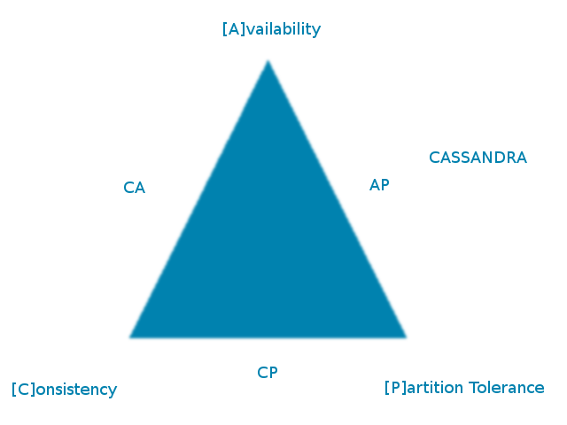

# Cassandra with Python


Cassandra is a [NoSQL](http://en.wikipedia.org/wiki/NoSQL) database that originated at Facebook.

Cassandra is optimized for fast writes and fast reads over very large volumes of data.

In contrast with traditional databases that journal database changes and then write them to disk,
Cassandra journals database changes and then writes them to a ___write-back cache___ (also known
as a ___write-behind cache___) - and only writes the cache to disk once the cache fills.

```
    Journal --> Cache --> Disk 
```

The Cassandra terms for these are the __commit log__, __Memtables__ and __SS Tables__ [which
stands for ___Sorted String Tables___; these are sorted in row order and are immutable].
The database write is successful and returns once the data is written to the __Memtable__.
How this data gets written to disk and propagated then depends on the ___replication policy___
(we will use simple replication).

As __SS Tables__ are immutable, deletes are handled via a logical delete indicator, which
is referred to as a ___Tombstone___ in Cassandra. Compaction is used to remove logically
deleted records [the uncompacted original SS Table continues to exist until the JVM runs
 GC (garbage collection)].

By design, there is no single point of failure.

In terms of the [CAP or Brewer's theorem](http://en.wikipedia.org/wiki/Cap_theorem), Cassandra is an ___eventually-consistent___
database. This means that replicas of a row may have different versions of the data - but only for brief periods. The replicas
will __eventually__ be synchronized and become consistent (hence the term).



[This is a slight over-simplification, as Cassandra can be extensively tuned for performance/consistency.]

## Motivation

Familiarization with `Cassandra` and `cql` with Python, using the [Datastax driver](http://datastax.github.io/python-driver/index.html).

This exercise follows on from my [Replicated Cassandra Database](http://github.com/mramshaw/Kubernetes/tree/master/Replicated%20Cassandra%20Database) exercise.

## Contents

The content are as follows:

* [Prerequisites](#prerequisites)
* [Cassandra driver](#cassandra-driver)
    * [Installation](#installation)
    * [Verification](#verification)
    * [Compression](#compression)
    * [Metrics](#metrics)
    * [Performance](#performance)
* [Running Cassandra](#running-cassandra)
    * [Run Cassandra with Docker](#run-cassandra-with-docker)
    * [Run Cassandra with Python](#run-cassandra-with-python)
* [Reference](#reference)
* [Versions](#versions)
* [To Do](#to-do)
* [Credits](#credits)

## Prerequisites

* Python installed

* `pip` installed

## Cassandra driver

The installation of the Cassandra driver (for Python) is slightly involved.

There are also optional components (including non-Python components).

#### Installation

Install the Cassandra driver as follows:

    $ pip install --user cassandra-driver

Or else:

    $ pip install --user -r requirements.txt

[This will also install some optional components, as discussed below.]

#### Verification

Verify installation as follows:

```bash
$ python -c 'import cassandra; print cassandra.__version__'
3.16.0
$
```

Or:

```bash
$ pip list --format=freeze | grep cassandra-driver
cassandra-driver==3.16.0
$
```

#### Compression

Optionally, install `lz4` (gets installed with `cassandra-driver` if using `requirements.txt`):

    $ pip install --user lz4

Verify installation as follows:

```bash
$ python -c 'import lz4; print lz4.__version__'
2.1.2
$
```

Or:

```bash
$ pip list --format=freeze | grep lz4
2.1.2
$
```

#### Metrics

Optionally, install `scales` (gets installed with `cassandra-driver` if using `requirements.txt`):

    $ pip install --user scales

The driver has built-in support for capturing `Cluster.metrics` about the queries run. The scales library is required to support this.

#### Performance

Optionally, install `libev` for better performance.

Verify the presence (or - as below - absence) of `libev` as follows:

```bash
$ python -c 'from cassandra.io.libevreactor import LibevConnection'
Traceback (most recent call last):
  File "<string>", line 1, in <module>
  File "/home/owner/.local/lib/python2.7/site-packages/cassandra/io/libevreactor.py", line 33, in <module>
    "The C extension needed to use libev was not found.  This "
ImportError: The C extension needed to use libev was not found.  This probably means that you didn't have the required build dependencies when installing the driver.  See http://datastax.github.io/python-driver/installation.html#c-extensions for instructions on installing build dependencies and building the C extension.
$
```

Installation instructions are here:

    http://datastax.github.io/python-driver/installation.html#libev-support

[We will not be installing `libev`.]

## Running Cassandra

We will test everything first with `Docker` and `cqlsh` and then we will use Python code to access our running Cassandra.

To make things clearer, pull the latest tagged `Cassandra` image, as follows:

    $ docker pull cassandra:3.11.3

[The current version is `3.11.3` as of this writing, but may change over time.]

#### Run Cassandra with Docker

[We will use Docker linking to expose Cassandra.]

Run Cassandra as follows:

    $ docker run --name python-cassandra cassandra:3.11.3

[We could run this detached with the `-d` option, but then we would have to tail the log with `docker logs python-cassandra`.
 As it is, the log will be produced in this console, allowing us to watch both consoles at the same time.]

In another console, set up a current directory environment variable as follows:

    $ export PWD=`pwd`

Run `cqlsh` as follows:

    $ docker run -it --link python-cassandra:cassandra --rm -v $PWD/cql:/cql cassandra:3.11.3 cqlsh cassandra -f /cql/users.cql

It should look more or less as follows:

```bash
$ docker run -it --link python-cassandra:cassandra --rm -v $PWD/cql:/cql cassandra:3.11.3 cqlsh cassandra -f /cql/users.cql

CREATE TABLE k8s_test.users (
    username text PRIMARY KEY,
    password text
) WITH bloom_filter_fp_chance = 0.01
    AND caching = {'keys': 'ALL', 'rows_per_partition': 'NONE'}
    AND comment = ''
    AND compaction = {'class': 'org.apache.cassandra.db.compaction.SizeTieredCompactionStrategy', 'max_threshold': '32', 'min_threshold': '4'}
    AND compression = {'chunk_length_in_kb': '64', 'class': 'org.apache.cassandra.io.compress.LZ4Compressor'}
    AND crc_check_chance = 1.0
    AND dclocal_read_repair_chance = 0.1
    AND default_time_to_live = 0
    AND gc_grace_seconds = 864000
    AND max_index_interval = 2048
    AND memtable_flush_period_in_ms = 0
    AND min_index_interval = 128
    AND read_repair_chance = 0.0
    AND speculative_retry = '99PERCENTILE';


 username | password
----------+----------
    Jesse |   secret
    Frank | password

(2 rows)
$
```

[Note that Cassandra has defaulted a lot of the table values for us. Here the default Compaction Strategy is
 __Size-Tiered__, which seems appropriate for the current use case - where the records will be written once.]

In the event it looks as follows, Cassandra probably has not fully started (and it may be necessary to retry):

```bash
$ docker run -it --link python-cassandra:cassandra --rm -v $PWD/cql:/cql cassandra:3.11.3 cqlsh cassandra -f /cql/users.cql
Connection error: ('Unable to connect to any servers', {'172.17.0.2': error(111, "Tried connecting to [('172.17.0.2', 9042)]. Last error: Connection refused")})
$
```

Now we can kill Cassandra in the original console with Ctrl-C. Once it has stopped, remove `python-cassandra`:

    $ docker rm python-cassandra

Clean up the data volumes as follows:

    $ docker volume prune

#### Run Cassandra with Python

[We will use Docker port-mapping to expose Cassandra; port 9042 must be available on the local machine.]

Run Cassandra as follows:

    $ docker run --name python-cassandra -p 9042:9042 cassandra:3.11.3

In another console, set up a current directory environment variable as follows:

    $ export PWD=`pwd`

Run `cqlsh` to set up our keyspace and table as follows:

    $ docker run -it --link python-cassandra:cassandra --rm -v $PWD/cql:/cql cassandra:3.11.3 cqlsh cassandra -f /cql/users.cql

[This will leave our table empty.]

Run command <kbd>python add_users.py</kbd> to add some users. This should look like:

```bash
$ python add_users.py
10 users added
$
```

Run command <kbd>python list_users.py</kbd> to list some users. This should look like:

```bash
$ python list_users.py
Row(username=u'user_7', password=u'password_7')
Row(username=u'user_6', password=u'password_6')
Row(username=u'user_1', password=u'password_1')
Row(username=u'user_2', password=u'password_2')
Row(username=u'user_4', password=u'password_4')
Row(username=u'user_9', password=u'password_9')
Row(username=u'user_3', password=u'password_3')
Row(username=u'user_8', password=u'password_8')
Row(username=u'user_5', password=u'password_5')
Row(username=u'user_0', password=u'password_0')
$
```

[Note that the users are listed in fairly random order. While the CQL Select statment does have an
 `Order By` clause, it does not have a run-time component and merely affects how indexes are read.]

And kill Cassandra in the original console with Ctrl-C. Once it has stopped, remove `python-cassandra`:

    $ docker rm python-cassandra

Finally, clean up the data volumes as follows:

    $ docker volume prune

## Reference

For the details of using Cassandra with Docker:

    http://hub.docker.com/_/cassandra/

## Versions

* Cassandra __3.11.3__
* cassandra-driver __3.16.0__
* lz4 __2.1.2__
* pip __18.1__
* python __2.7.12__
* scales __1.0.9__

## To Do

- [x] Write Python code
- [ ] More testing

## Credits

There are many fine resources for learning Cassandra. The place to start is:

    http://datastax.github.io/python-driver/getting_started.html

[Well worth careful study for the sections on
 [type conversion](http://datastax.github.io/python-driver/getting_started.html#type-conversions),
 [consistency level](http://datastax.github.io/python-driver/getting_started.html#setting-a-consistency-level)
and
 [prepared statements](http://datastax.github.io/python-driver/getting_started.html#id2).
]

Also:

    http://datastax.github.io/python-driver/installation.html

[For the intricacies of installing the Python driver.]

And:

    https://www.datastax.com/dev/blog/materialized-view-performance-in-cassandra-3-x

[Materialized views seem to be a way of imposing a finer index on stored data. There is a performance penalty.]
